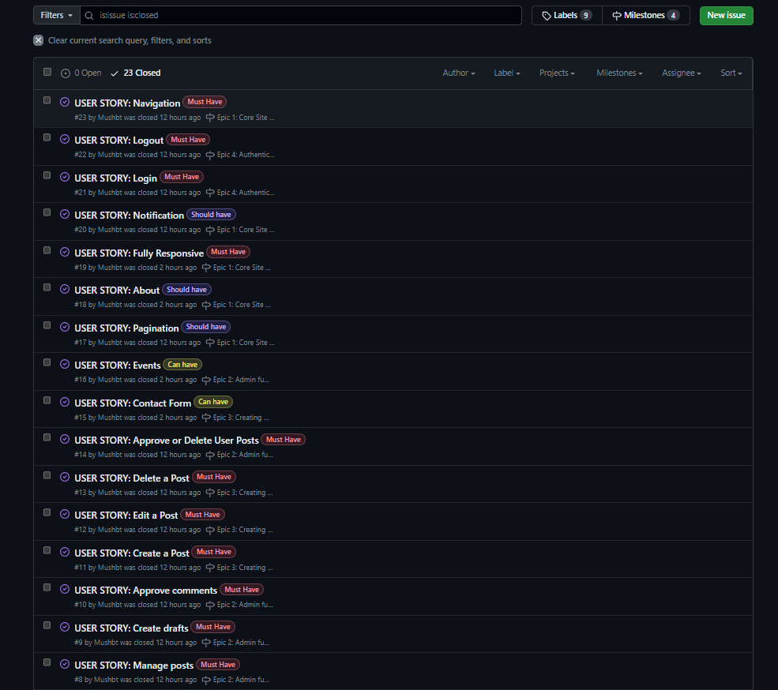
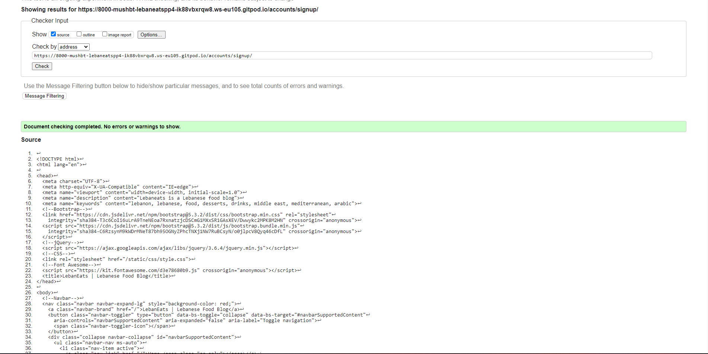

# Lebaneats | Lebanese Food Blog

**Developer: Mustafa Habet**

[Visit live website](Link goes here)

## Table of Contents
 - [About](#about)
 - [User Goals](#user-goals)
 - [Site Owner Goals](#site-owner-goals)
 - [User Experience](#user-experience)
 - [User Stories](#user-stories)
 - [Design](#design)
    - [Colours](#colours)
    - [Fonts](#fonts)
    - [Structure](#structure)
      - [Website pages](#website-pages)
      - [Database](#database)
    - [Wireframes](#wireframes)
- [Technologies Used](#technologies-used)
- [Features](#features)
- [Validation](#validation)
- [Testing](#testing)
    - [Manual testing](#manual-testing)
    - [Tests on various devices](#tests-on-various-devices)
    - [Browser compatibility](#browser-compatibility)
- [Bugs](#bugs)
- [Heroku Deployment](#heroku-deployment)
- [Credits](#credits)
- [Acknowledgements](#acknowledgements)

### About
Lebaneats Food Blog is a fictional blog dedicated to Lebanese Food. Users can view other user's recipes and can create their own account to share a recipe of their own.

### User Goals

- To explore Lebanese cuisine in the hope of trying new flavours.
- To find a new recipe or to find a variation of a recipe.
- To know what ingredients are used for a specific recipe.
- To see how a specific dish was made.
- To see how easy or hard a dish is to prepare.
- To see how long a dish will take to prepare.
- To be able to see other users reviews or comments on a specific recipe.
- To be able to share a recipe with others.

### Site Owner Goals
- Fully responsive.
- To provide a easy to navigate through blog.
- To share my own recipes.
- To allow users to share their own recipes.
- To allow users to review or comment on the different recipes.

## User Experience

### Target Audience
- Users who enjoy cooking and experimenting with recipes at home.
- Users who are new to cooking or less experienced in the kitchen.
- Users who enjoy trying new foods, cuisines and unique recipes.
- Users who like to share their own variations of recipes.

### User Requirements and Expectations
- Fully responsive
- A welcoming design
- Simple to use and navigate through
- Social media

##### Back to [top](#table-of-contents)

## User Stories

### Users

- As a Site User I can view a list of posts so that I can select one to read (Must Have)
- As a Site User I can click on a post so that I can read the full text (Must Have)
- As a Site User / Admin I can view the number of likes on each post so that I can see which is the most popular or viral (Must Have)
- As a Site User / Admin I can view comments on an individual post so that I can read the conversation. (Must Have)
- As a Site User I can navigate easily through the site so that I can move between the different features of the site (Must Have)

### Admin / Authorised User

- As a Site User I can register an account so that I can create, edit, delete a post as well as liking and commenting on other posts (Must Have)
- As a Site User I can leave comments on a post so that I can be involved in the conversation (Must Have)
- As a Site User I can like or unlike a post so that I can interact with the content (Must Have)
- As a Site User I can create a post so that other site users can view it (Must Have)
- As a Site User I can edit the post that I have created so that I can add or remove anything I have forgotten or added by accident (Must Have)
- As a Site User I can delete my post so that other site users cannot see it (Must Have)
- As a Site User I am notified when I post, edit and delete a post or when I register, login or logout of my account so that I know if my intended action was successful (Should have)
- As a Site User I can login so that I can have access to all functions of the site (Must Have)
- As a Site User I can logout so that I can secure my account on the site (Must Have)

### Site Owner

- As a Site Admin I can approve or disapprove user posts so that I can manage my blog content (Must Have)
- As a Site Admin I can create draft posts so that I can finish writing the content later (Must Have)
- As a Site Admin I can approve or delete comments so that I can filter out objectionable comments (Must Have)
- As a Site Owner I can provide pagination so that users have better user experience while on the site (Should Have)
- As a Site Owner I can provide an about us page so that the user can get information on what the site or content is about (Should Have)
- As a Site Owner I can provide a fully responsive site so that users have a good user experience (Must Have)

### Won't Have / Future Functionality
- As a Site User I can contact the admin so that I can report any issues with the site
- As a Admin I can create events so that Site Users can attend for example an online cooking tutorial

### Kanban, Epics & User Stories
- GitHub Kanban was used to track all the user stories
- Epics were created using the milestone feature

Kanban

Epics

User Stories

##### Back to [top](#table-of-contents)

## Design

### Colors
I chose the colors of the Lebanese flag as I thought this would compliment a Lebanese food blog which should be bright and colorful.

See color pallet and flag

### Fonts
I decided to keep the simple font that Bootstrap provides via the Bootstrap CSS. Reason was that the site was colorful and changing the font made it unfocusing.

### Structure

#### Site Pages
- The site consists of the following pages:
  - A Home page that is supposed to look like the Lebanese flag with a welcome message.
  - An About page that tells users what the blog is about and what to expect when it comes to Lebanese cuisine.
  - A blog page where recipes for different Lebanese dishes can be found. Registered users can also create, edit, and delete their recipes.
  - A Share a Recipe page where registered users can share their own recipes.
  - A Edit Recipe page where recipe owners can edit their posts.
  - A Register page where users can register to be able to access all functionality of the site.
  - A login page where registered users can login.
  - A logout page for users to logout from site once they are done. 

#### Database

- When creating the database structure schema for this project, I made use of the [Figma](https://figma.com/) website. This online tool provided me with a visual platform to create and document the database schema, streamlining the planning and implementation process for the blog application's database.

Database Schema

#### User Model
The User Model is a builtin Django model which contains the following.
- user_id
- first_name
- last_name
- email
- password
- groups
- user_permission
- is_staff
- is_active
- is_superuser
- last_login
- date_joined

#### Post Model
The Post Model contains the following:
- title
- slug
- author(ForeignKey)
- updated_on
- instructions
- featured_image
- exerpt
- created_on
- status
- likes
- recipe_length
- recipe_difficulty
- ingredients
- is_approved

#### Comment Model
The Comment Model contains the following:
- post(ForeignKey)
- name
- email
- body
- created_on
- approved

### Wireframes

## Technologies Used

### Languages & Frameworks

- HTML
- CSS
- Javascript
- Python
- Django

### Libraries & Tools

- [Am I Responsive](http://ami.responsivedesign.is/)
- [Bootstrap v5](https://getbootstrap.com/)
- [Cloudinary](https://cloudinary.com/)
- [Chrome dev tools](https://developers.google.com/web/tools/chrome-devtools/)
- [Font Awesome](https://fontawesome.com/)
- [Git](https://git-scm.com/)
- [GitHub](https://github.com/)
- [Heroku Platform](https://id.heroku.com/login)
- [jQuery](https://jquery.com)
- [Postgres](https://www.postgresql.org/)
- [Summernote](https://summernote.org/)
- Validation:
  - [WC3 Validator](https://validator.w3.org/)
  - [Jigsaw W3 Validator](https://jigsaw.w3.org/css-validator/)
  - [PEP8CI](https://pep8ci.herokuapp.com/)
  - [Lighthouse](https://developers.google.com/web/tools/lighthouse/)

##### Back to [top](#table-of-contents)

## Features

### Home page
The home page includes a navbar, a main body, and a footer.

See featured image

### Logo & Navigation
- Blog Logo.
- Fully Responsive.
- Switches to hamburger menu on small screens.
- Displayed on all pages.

See featured images

### Footer
- Contains social media links and copyright.
- Displayed on all pages.

See featured image

### About Us
- Gives users more information about why the this site was created
- Gives users more information about Lebanese cuisine

See featured image

### Sign up / Register
- Allows users to register an account.
- Username and password are required but email is optional.

See featured image

### Login
- Users can login to create a recipe, edit their recipe, delete their recipe, like and comment on all recipes on the blog page.

See featured image

### Logout
- Allows the user to securely log out.
- Asks the user if they are sure they want to logout.

See featured image

### Blog
- The blog displays each post that has been created by the admin or user.
- Pagination is used to display 6 posts per page.

See featured image

### Create Post
- Allows registered users to create recipe posts that will be viewed on the blog page once the admin has authorized it.
- User will add the recipe name, difficulty, length, ingredients and instructions.

See featured image

### Edit Post
- Allows registered users to edit their own recipe posts incase they have forgotten anything or want to just remove something.

See featured image

### Delete Post
- Allows registered users to delete their own recipe posts incase they don't want it on the blog anymore.

See featured image

### Like
- Allows registered users to like any recipe posts they see on the blog page.

See featured image

### Comment
- Allows registered users to comment on any recipe posts they see on the blog page.
- All comments must be authorized by the Admin to avoid any negativity.

See featured image

### Social Media Links
- A clickable logo for all the social media platforms provided.
- All links open in a new tab for better user experience.
- Displayed on all the pages of the site.

See featured image

### Pagination
- Pagination is used on the blog page
- It ensures the page is kept tidy as it only allows for 6 recipe posts per page.

See featured image

##### Back to [top](#table-of-contents)

## Validation

### HTML Validation
The W3C Markup Validation Service

Home

About

Blog

Share a recipe

Register

Login

Logout

Add recipe

Edit recipe

### CSS Validation
The W3C Jigsaw CSS Validation Service

Style.css

### PEP8 Validation
 was used to validate Python

Lebaneats

urls.py

Blog

admin.py

forms.py

models.py

urls.py

views.py

### Lighthouse

Performance, best practices, and SEO were tested using Lighthouse.

#### Desktop

Index

About Us

Blog

Post

Register

Login

Logout

Create recipe

Edit recipe

#### Mobile

Index

About Us

Blog

Post

Register

Login

Logout

Create recipe

Edit recipe

##### Back to [top](#table-of-contents)

## Testing

### Manual Testing

1. As a Site User I can view a list of posts so that I can select one to read

**Step** | **Expected Result** | **Actual Result**
------------ | ------------ | ------------ |
| Click on the 'Blog' link in the navigation bar | Blog will load| Works as expected |

See featured image

2. As a Site User I can click on a post so that I can read the full text

**Step** | **Expected Result** | **Actual Result**
------------ | ------------ | ------------ |
| Click on any 'Post' on the blog page | Post will open up| Works as expected |

See featured image

3. As a Site User / Admin I can view the number of likes on each post so that I can see which is the most popular or viral

**Step** | **Expected Result** | **Actual Result**
------------ | ------------ | ------------ |
| Once on the blog page | All posts have a heart with a number to show how many likes it has| Works as expected |

See featured image

4. As a Site User / Admin I can view comments on an individual post so that I can read the conversation

**Step** | **Expected Result** | **Actual Result**
------------ | ------------ | ------------ |
| Once any post is clicked, the post will open | Comments are rendered on the bottom of the post| Works as expected |

See featured image

5. As a Site User I can register an account so that I can create, edit, delete a post as well as liking and commenting on other posts

**Step** | **Expected Result** | **Actual Result**
------------ | ------------ | ------------ |
| Click on the 'Members' link in the navigation bar and on the drop down menu click on the 'Register' link | Register form will load| Works as expected |
| Fill the form and click 'Sign up' button | Blog page will open with a 'success' message at the top so the user knows they have registered | Works as expected |

See feature images

6. As a Site User I can leave comments on a post so that I can be involved in the conversation

**Step** | **Expected Result** | **Actual Result**
------------ | ------------ | ------------ |
| If you are logged in, once on a specific post, you can write a comment in the 'Leave a Comment' section and press Submit | Post page will reload and a 'waiting for approval message will appear'. Once admin has approved, comment will appear in the 'Comments' section | Works as expected |

See featured image

7. As a Site User I can like or unlike a post so that I can interact with the content

**Step** | **Expected Result** | **Actual Result**
------------ | ------------ | ------------ |
| If you are logged in, once on a specific post, press on the heart icon | if you have not liked the post before, heart will turn black and number will increment by 1 | Works as expected |
| If you are logged in, once on a specific post, press on the heart icon | if you liked the post before, heart will turn white and number will decrement by 1| Works as expected |

See featured images

8. As a Site Admin I can approve or delete user posts so that I can manage my blog content

**Step** | **Expected Result** | **Actual Result**
------------ | ------------ | ------------ |
| Once Admin has logged in to the 'Admin' backend page, admin must press on the 'Posts' link under the 'Blog' section. Then admin must tick the white box beside the post they want to approve. Once done, they press on the drop down menu which is labeled 'Action'. Once on drop down menu, admin must press on 'Approve Recipe' and then press on the 'Go' button | The posts status will go from 'Draft' to 'Published', which will be the 3rd column on the specific post row.| Works as expected |
| Once Admin has logged in to the 'Admin' backend page, admin must press on the 'Posts' link under the 'Blog' section. Then admin must tick the white box beside the post they want to delete. Once done, they press on the drop down menu which is labeled 'Action'. Once on drop down menu, admin must press on 'Delete Selected Posts' and then press on the 'Go' button. Once pressed, a new page will load asking the Admin if they are sure they want to delete the post. Admin must then press on the 'Yes, I'm sure button' | Post will be deleted and a 'Successfuly deleted' message will appear| Works as expected |

See featured image

9. As a Site Admin I can create draft posts so that I can finish writing the content later

**Step** | **Expected Result** | **Actual Result**
------------ | ------------ | ------------ |
| Once Admin has logged in to the 'Admin' backend page, admin can press on the 'Add' link next to Posts under the 'Blog' section. A 'Add Post' page will load and the admin can fill out the Post form. If they do not want it published, they can use the drop down menu by the 'Status' section to choose 'Draft'. Admin must then press the 'Save' button.| Admin 'Post' page will load and a 'Post added successfully' message will appear.| Works as expected |

See featured images

10. As a Site Admin I can approve or delete comments so that I can filter out objectionable comments

**Step** | **Expected Result** | **Actual Result**
------------ | ------------ | ------------ |
| Once Admin has logged in to the 'Admin' backend page, admin must press on the 'Comments' link under the 'Blog' section. Then admin must tick the white box beside the comment they want to approve. Once done, they press on the drop down menu which is labeled 'Action'. Once on drop down menu, admin must press on 'Approve Comment' and then press on the 'Go' button | The comment 'Approved' coloumn will have a green tick which indicates the comment was approved | Works as expected |
| Once Admin has logged in to the 'Admin' backend page, admin must press on the 'Comments' link under the 'Blog' section. Then admin must tick the white box beside the comment they want to delete. Once done, they press on the drop down menu which is labeled 'Action'. Once on drop down menu, admin must press on 'Delete Selected Comment' and then press on the 'Go' button. Once pressed, a new page will load asking the Admin if they are sure they want to delete the comment. Admin must then press on the 'Yes, I'm sure button'  | Post will open up| Comment will be deleted and a 'Successfuly deleted' message will appear |

See featured image

11. As a Site User I can create a post so that other site users can view it

**Step** | **Expected Result** | **Actual Result**
------------ | ------------ | ------------ |
| Once Site User is a member, they can click on the 'Share a Recipe' tab in the navbar. Add a Recipe page will render where the User must fill out all the fields in the form. Once done, they must press on the 'Submit' button on the bottom of the form. | Blog page will render with a message at the top of the page stating that their post is waiting approval. Post will show on the blog once approved by the admin | Works as expected |

See featured images

12. As a Site User I can edit the post that I have created so that I can add or remove anything I have forgotten or added by accident.

**Step** | **Expected Result** | **Actual Result**
------------ | ------------ | ------------ |
| Once the registered user has logged in, they can click on their post on the blog page. Once their post has rendered, they should press on the 'Edit' button which is located under the post image. Edit your recipe form will render which the user can then make their updates on. Once the user is finished editing, they should press on the 'Edit' button at the bottom of the form. | Blog page will render and a message will appear on the top of the page telling the user they successfully updated their recipe. | Works as expected |

See featured images

13. As a Site User I can delete my post so that other site users cannot see it

**Step** | **Expected Result** | **Actual Result**
------------ | ------------ | ------------ |
| Once the registered user has logged in, they can click on their post on the blog page. Once their post has rendered, they should press on the 'Delete' button which is located under the post image. |  Blog page will render and a message will appear on the top of the page telling the user they successfully deleted their recipe.| Works as expected |

See featured image

14. As a Site Owner I can provide pagination so that users have better user experience while on the site

**Step** | **Expected Result** | **Actual Result**
------------ | ------------ | ------------ |
| Once there are 6 posts on the blog page.  | The 7th post will appear on another page which can be accessed by pressing on the 'Next' button at the bottom of the blog page | Works as expected |

See featured image

15. As a Site Owner I can provide an about us page so that the user can get information on what the site or content is about

**Step** | **Expected Result** | **Actual Result**
------------ | ------------ | ------------ |
| Click on the 'About Us' link in the navigation bar | About us page will render | Works as expected |

See featured image

16. As a Site Owner I can provide a fully responsive site so that users have a good user experience

**Step** | **Expected Result** | **Actual Result**
------------ | ------------ | ------------ |
| Pages that do not require login were tested on [Am I Responsive](https://ui.dev/amiresponsive) | All pages were responsive on different screen sizes | Works as expected |
| Pages that were not able to be tested on [Am I responsive](https://ui.dev/amiresponsive) due to CSRF verification failure were tested on [Google Dev Tools](https://developer.chrome.com/docs/devtools/) | All pages were responsive on different screen sizes | Works as expect |

See featured images

17. As a Site User I am notified when I post, edit and delete a post or when I register, login or logout of my account so that I know if my intended action was successful

**Step** | **Expected Result** | **Actual Result**
------------ | ------------ | ------------ |
| When the user posts a recipe  | User will see a message indicating that the post needs to be authorized | Works as expected |
| When a user edits their post | User will see a message indicating update was successful | Works as expected |
| When a user deletes their post | User will see a message indicating deletion was successful | Works as expected |
| When a user signs up the site | User will see a message indicating that they have signed in successfully | Works as expected |
| When a user logs in | User will see a message indicating login was successful | Works as expected |
| When a user logs out | User will see a message indicating logout was successful | Works as expected |

See featured images

18. As a Site User I can login so that I can have access to all functions of the site

**Step** | **Expected Result** | **Actual Result**
------------ | ------------ | ------------ |
| Registered user can login via the members tab in the nav bar | Users will have full access to all functions of the site | Works as expected |

See featured images

19. As a Site User I can logout so that I can secure my account on the site

**Step** | **Expected Result** | **Actual Result**
------------ | ------------ | ------------ |
| Users can logout via the members tab in the nav bar | Users will be logged out | Works as expected |

See featured image

20. As a Site User I can navigate easily through the site so that I can move between the different features of the site

**Step** | **Expected Result** | **Actual Result**
------------ | ------------ | ------------ |
| Users can navigate through all the links and tabs on the nav bar | pages will render depending on what user has clicked on | Works as expected |
| Users can access external social media links in the footer | External social media websites will open in a separate window | Works as expected |

See featured images

##### Back to [top](#table-of-contents)

### Device Testing & Browser Compatibility

The live site was tested by me, my friends, my family and members of the Slack Community.

The following devices were used: 
- Iphone 12 pro
- Samsung S10 Plus
- Samsung S21 Plus
- Iphone XS Max
- Iphone 13
- Samsung S22 Plus
- Ipad Mini
- Desktop
- Laptop
- Samsung Tab

The following browsers were used:
- Google Chrome
- Safari
- Samsung Internet
- Firefox

## Bugs

# Fixed

| **Bug** | **Fix** |
| ------- | ------- |
| Form content was not rendering when a recipe post was opened | I adjusted the code in the post_detail html file so it takes the relevant fields from the post model |
| Form titles were not rendering. User would not be able to tell the form sections apart | I adjusted the code in the post_detail html file and added the 
 element above the relevant form section. This is a temporary solution until I find a better way to do it|
| I was getting NameError when trying to delete a post | I had forgotten to add 'redirect' in the import from django on my views.py file |
| Error message TemplateSyntaxError when trying to add a post | I had forgotten to add  to the top of the add_recipe html file |
| When trying to make a comment TypeError was occuring | dateTimeField had to be changed from False to True on my comment model|
| Drop down menu in my navbar was not working correctly as I had copied the code from an older version of Bootstrap | So instead of data-toggle I needed to add data-bs-toggle |

# Not Fixed

##### Back to [top](#table-of-contents)

### Heroku Deployment

### Fork Repository
To fork the repository by following these steps:
1. Go to the GitHub repository
2. Click on Fork button in upper right hand corner

### Clone Repository
You can clone the repository by following these steps:
1. Go to the GitHub repository 
2. Locate the Code button above the list of files and click it 
3. Select if you prefer to clone using HTTPS, SSH, or Github CLI and click the copy button to copy the URL to your clipboard
4. Open Git Bash
5. Change the current working directory to the one where you want the cloned directory
6. Type git clone and paste the URL from the clipboard ($ git clone https://github.com/YOUR-USERNAME/YOUR-REPOSITORY)
7. Press Enter to create your local clone.

## Credits

### Images

### Code
- I used the [Code Institute](https://codeinstitute.net/) 'I Think Therefore I Blog' walkthrough as my project base but I edited the models, added my own CRUD functionality and made changes to some of the initial design.

## Acknowledgements
The site was done as part of a project piece for my Full Stack Software Development Diploma at the [Code Institute](https://codeinstitute.net/).
I would like to thank my mentor Mo Shami for all his advice and help throughout. I would like to also thank the Slack community and the tutors at The Code Institute for their help whenever it was needed.

Mustafa Habet 2023.
